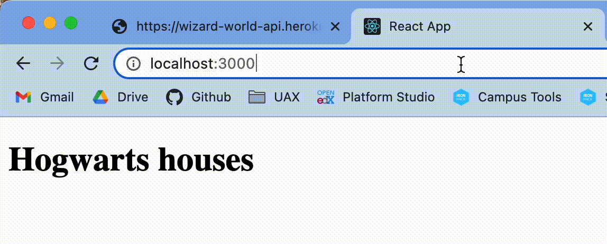
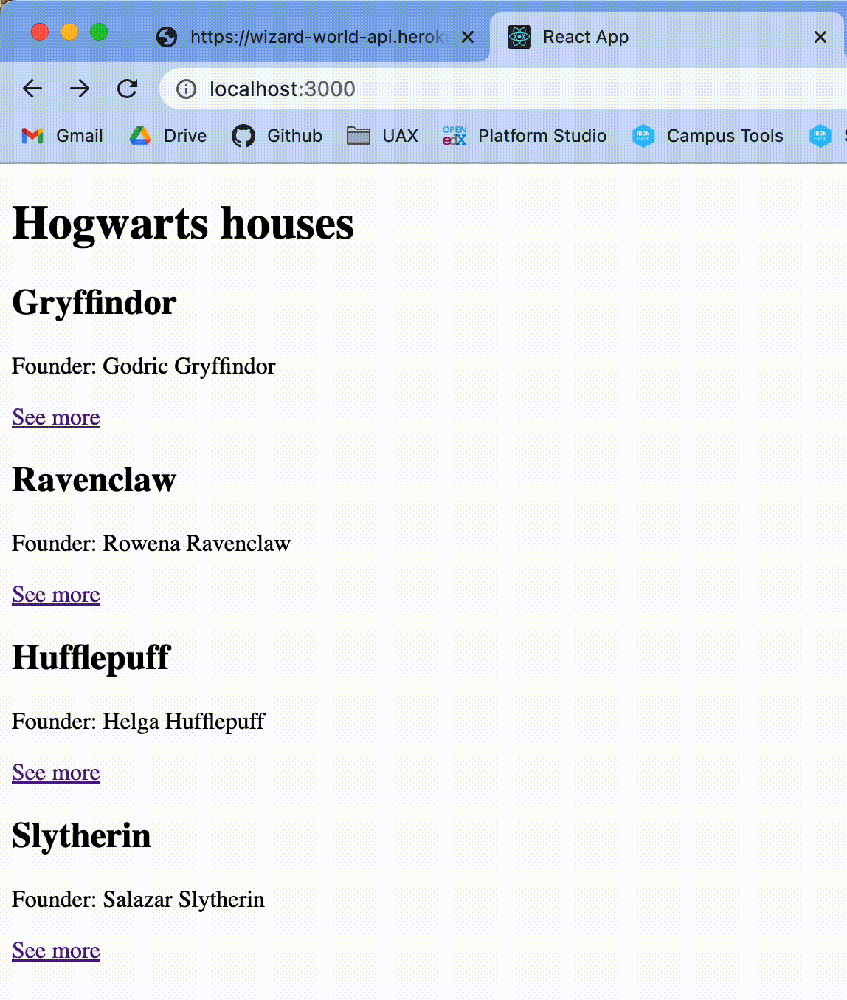
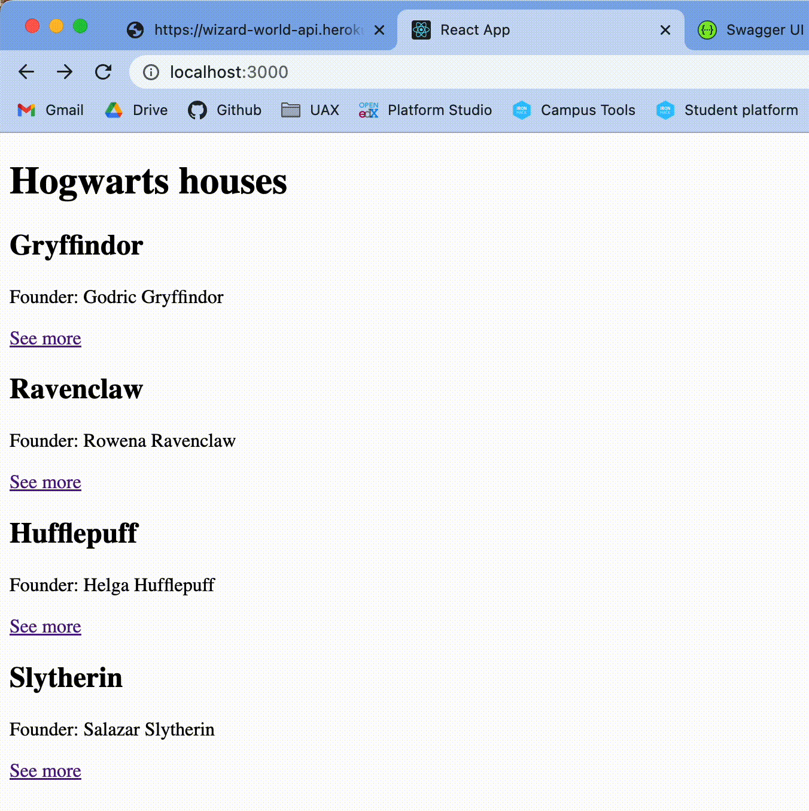

# Wizarding app 🪄

Hello developer! Today you are going to use everything you've learnt in react so far. You are going to do an application with a real API.

This app was created with `create-react-app`. `React-router-dom` and `axios` have already been installed, so all you need to do is:

```bash
npm install
npm start
````


## Iteration 1: pages and routes config 🎢

- Create a folder called `pages`
- Create a page component called `Home`. For now this component will only show an `<h1>` with the title "Hogwarts houses".
- Do everything you need to create the routes necessary, so that the index URL (localhost:3000/) displays this component.
- Add an Error Page for the users to see when the URL does not match any of the paths specified.

This is the expected result from this iteration:



---

## Iteration 2: the Home component 🏡

For this iteration you will be using real API documentation. Check out the different methods they have:

[Wizarding API](https://wizard-world-api.herokuapp.com/swagger/index.html)

This is how it works: the base URL for all the calls is always going to be the same: `https://wizard-world-api.herokuapp.com/`, and then you can add the different endpoints to get specific content. 

For instance, if you wanted to get all the *spells*, you would make a **GET axios call** to `https://wizard-world-api.herokuapp.com/spells`.

The Home component should:

- Have a state for the `houses`, that will be initialized as `null`.
- Have a state for a possible `error`, that will be initialized as `null`.
- Create a function called `getHouses`, which will asynchronosuly make a GET axios call to the endpoint with all the **houses** of Hogwarts.
- This function should be called only `after the first render of the component`.
- If the response of this call is successful, it should update the `houses` state and add the list of houses fetched from the API. 💡 _Remember that axios places all the content from the calls inside a `data` object._.
- If the response is unsuccessful, then the `error` state should be true.

### What does this component `return`?
A list of all the houses, with: 
- Name
- Founder
- A "see more" link that will go to to the detail of the house, using its ID (it should go 'houses/id'). (For now, we don't have this route configured so it shouldn't get you anywhere).

IF there is an error (if error is true), it should display an error message instead.

This is the expected result from this iteration:



---

## Iteration 3: The details 🔮

- Create a route that will dynamically get a `:houseId`. 
- Create a page component called `HouseDetails` for this route.

The `HouseDetails` component should:
- Get the id of the house with `react-router-dom`'s params.
- Have a `house` state that will be initialized as null.
- Have an `error` state that will be initialized as null.
- _The first time the component renders_, it should use this _params id_ to fetch the information of the specific house with axios and update the state with this information.
- Remember to use string interpolation to add the id of the house to the axios GET API call.

> 💡 Remember to check the [API's documentation](https://wizard-world-api.herokuapp.com/swagger/index.html) to see if you can fetch the information of only a specific house using its id.

### What should the `HouseDetails` component return?

Return all the elements shown in the expected result:



> 💡 Remember to console.log as much as you need to know how elements are called in this specific API.

✅ All done!


